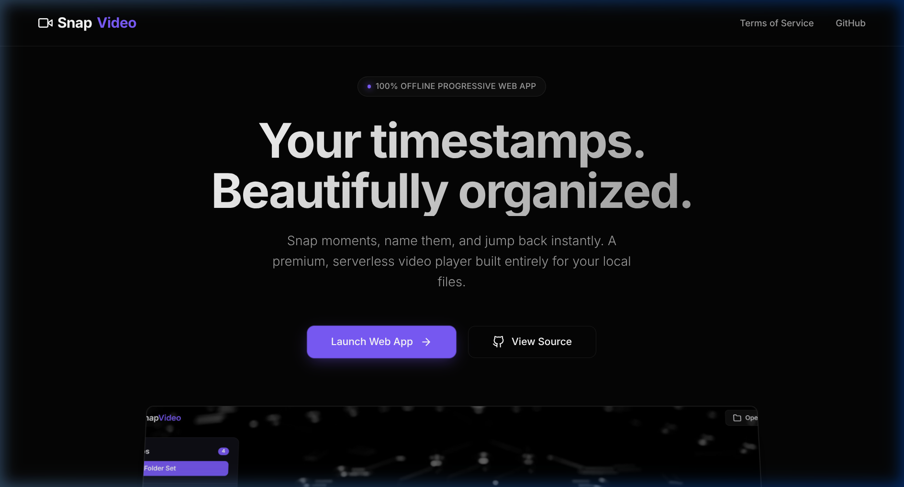
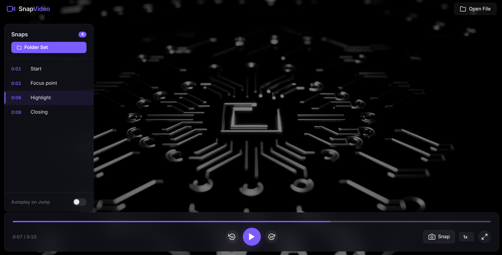

# SnapVideo

SnapVideo is a minimalistic video player that allows you to bookmark timestamps ("snaps") and jump back to them instantly. Built purely on modern web technologies, it features an elegant dark theme, robust offline support, and file system persistence.




## Features

- **Timestamp Snapping**: Pause, name the moment, and jump back anytime.
- **Persistence**: Save your snaps to a local directory for permanent access without servers.
- **Minimalist Design**: Black-themed, premium UI with disappearing overlay controls.
- **Keyboard & Mouse Control**: Easy seeking, playback speed control, and smooth interface navigation.
- **Offline Capable**: Runs purely locally as a Progressive Web App (PWA).

## How to Use

1. **Load a Video**: Navigate to `/app` (the application view) and drag and drop an `.mp4` or `.mov` file onto the browser window. Alternatively, click "Open File" in the top bar.
2. **Snap a Moment**: Once the video is playing, click the "Snap" button on the bottom right (or look for the `📸` icon) to bookmark the current timestamp. Name it so you can remember it!
3. **Jump Back**: Hover over the left side of the screen to reveal the "Snaps" panel. Click any saved snap to instantly seek to that point. 
4. **Persistent Storage (Optional)**: If you want your snaps to remain saved across sessions, click the `Set Folder` button on the "Snaps" panel and select a local folder on your machine. All snap info will be persisted inside a `.snapinfo` file there.

## Launching locally

Since this is a client-side application without heavy backend dependencies, you can serve it via a basic HTTP server, or host it statically.

```bash
npx serve .
# Or run your preferred static file server.
```

## Contributing

Please see `Agents.md` for our internal philosophy on AI Agents and how to maintain and extend this repository.
